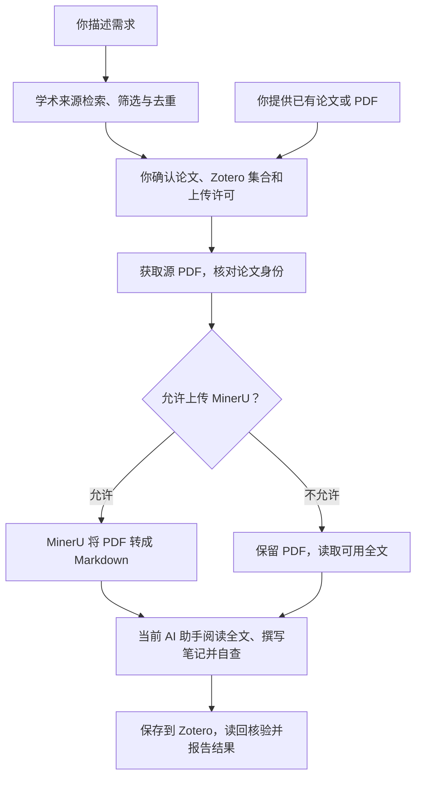

# Paper to Zotero

告诉 AI 你想研究什么，它会帮你找论文、整理候选清单。你选好后，它会获取全文、按论文语种生成结构化阅读笔记，并保存到 Zotero。已有的 PDF 也能直接处理。本仓库包含两个独立 skill：`paper-to-zotero` 负责文献整理入库，`discussion-drafter` 负责根据你的研究结果和库内文献撰写讨论。

## 一句话开始

把下面这句话复制给你正在使用的 AI 助手：

> 请按照 https://github.com/Timisic/paper2zotero-skill/blob/main/install/AGENT_SETUP.md ，帮我安装并配置这个文献工具，安装到我当前使用的助手中。

它会准备需要的工具，再打开配置向导。你只需按向导提示，打开对应的网页获取相关的API KEY，粘贴回向导中。

默认 setup 依次是：**准备工具 → 连接 Zotero → 连接 OpenAlex（必配）→ 配置pdf转md（MinerU）→ 检查结果 → 更多配置（可选）**。最后还会询问你是否想换用自己的总结提示词。

## 装好后怎么用

平时就在 Claude Code、Codex 的对话里使用。你负责提出需求、选择论文，助手负责后续处理。

1. **告诉助手你想读什么。** 例如：“帮我找 2024 年以来 AI 支持自我调节学习的研究，优先有真人干预实验，筛选 5 篇。”助手会给出题目、来源和入选理由。
2. **一次确认。** 例如：“选 1、2、4，保存到 Zotero 的‘AI 与学习’，允许上传 MinerU。”
3. **查看结果。** 助手会列出每篇的 PDF、Markdown、阅读笔记、Zotero 入库和本地同步状态，以及未完成的原因。到指定 Zotero 集合中即可查看论文和笔记。

已有 DOI、论文链接或 PDF 时，直接提供给助手即可。例如：

> 把这些 PDF 整理到 Zotero 的“AI 心理健康”文件夹，按论文语种分析每篇的问题、挑战、洞见、创新、潜在缺陷和研究动机。


## 用库内文献撰写讨论

[Discussion 撰写助手](discussion-drafter/SKILL.md) 是独立 skill：根据你的研究结果，通过已连接的 Zotero MCP 读取指定分类集合及子集合的笔记，核对关键论断，再生成四部分讨论正文与 APA 第七版参考文献表。默认不导出机器可读引用文件。

> 使用 discussion-drafter。研究背景是……，核心发现是……；只使用 Zotero 中“AI 与学习”集合及子集合的文献，撰写中文讨论。

安装向导会把两个 skills 一起安装到所选的 Codex、Claude Code 或 Pi。讨论助手需要已连接的 Zotero MCP，并能读取目标集合；文件安装完成不代表 MCP 已连接。文献入库完成后，助手会提示你可以使用它。引用准确性取决于原文证据及文献元数据，读取或核对失败会明确标记。

## 处理流程



检索按可用配置调用 OpenAlex、Semantic Scholar 等来源；有公开 PDF 时直接下载，需要机构访问时才借助 Kimi Webbrige 登录浏览器获取 PDF。MinerU 负责把 PDF 转成 md 文字，**阅读分析由当前 AI 助手完成**。

笔记默认跟随论文语种，没有固定字数限制。你可以换用自己的总结提示词：编辑当前已安装 skill 中的 `references/paper-summary.md`。setup 末尾会显示实际路径；[修改位置与方法](install/HELP.md#更换总结提示词)也可随时查阅。

<details>
<summary>自己安装，或继续上次的配置</summary>

**Windows 10/11**：打开 PowerShell，粘贴：

```powershell
irm https://raw.githubusercontent.com/Timisic/paper2zotero-skill/main/install/install.ps1 | iex
```

**macOS / Debian / Ubuntu**：打开终端，粘贴：

```bash
curl -fsSL https://raw.githubusercontent.com/Timisic/paper2zotero-skill/main/install/install.sh | bash
```

已经下载仓库：Windows 双击 `install/setup.cmd`；macOS/Linux 运行 `bash install/setup.sh`。

以后可让助手“继续文献工具的配置”或“打开文献工具的更多设置”。[安装与使用帮助](install/HELP.md)包含 Windows 操作说明、数据流向和常见问题。

</details>

<!-- repository-only -->

[开发与验证说明](docs/README.md) · [Agent 安装说明](install/AGENT_SETUP.md)
